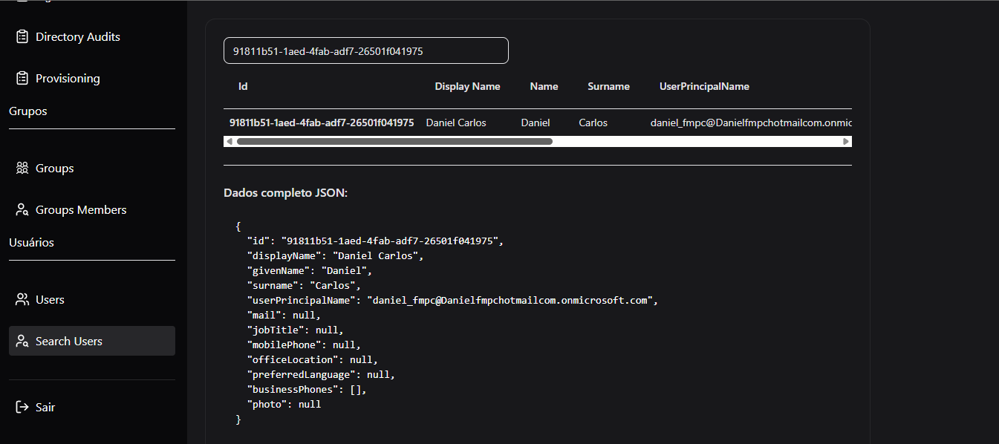

# Azure Authentication Application

This project is a full-stack application that implements Azure Active Directory (Azure AD) authentication, featuring a React frontend and .NET backend.

## Features

- 🔐 Azure AD Authentication
- 👥 User Management
- 👥 Group Management
- 📊 Directory Audits
- 🔍 User Search
- 📝 Sign-in Logs
- 👤 User Profile Management

## Project Structure

The project is divided into two main components:

- `azure-auth-client/`: React frontend application
- `AzureAuthApi/`: .NET backend API

## Screenshots

### Authentication


### Perfil


### User Management



### Group Management


### Monitoring and Auditing


### Provisioning


### Application Interface


## Getting Started

### Prerequisites

- Node.js 
- Bun
- .NET 10 SDK 
- Azure subscription with Azure AD

### Installation

1. Clone the repository
2. Set up the backend:
   ```bash
   cd AzureAuthApi
   dotnet restore
   dotnet run
   ```

3. Set up the frontend:
   ```bash
   cd azure-auth-client
   npm install
   npm start
   ```

## Configuration

The application requires Azure AD configuration. Make sure to set up the following:

1. Register your application in Azure AD
2. Configure the necessary permissions
3. Set up the required environment variables

## Contributing

Feel free to submit issues and enhancement requests.

## License

This project is licensed under the MIT License.
